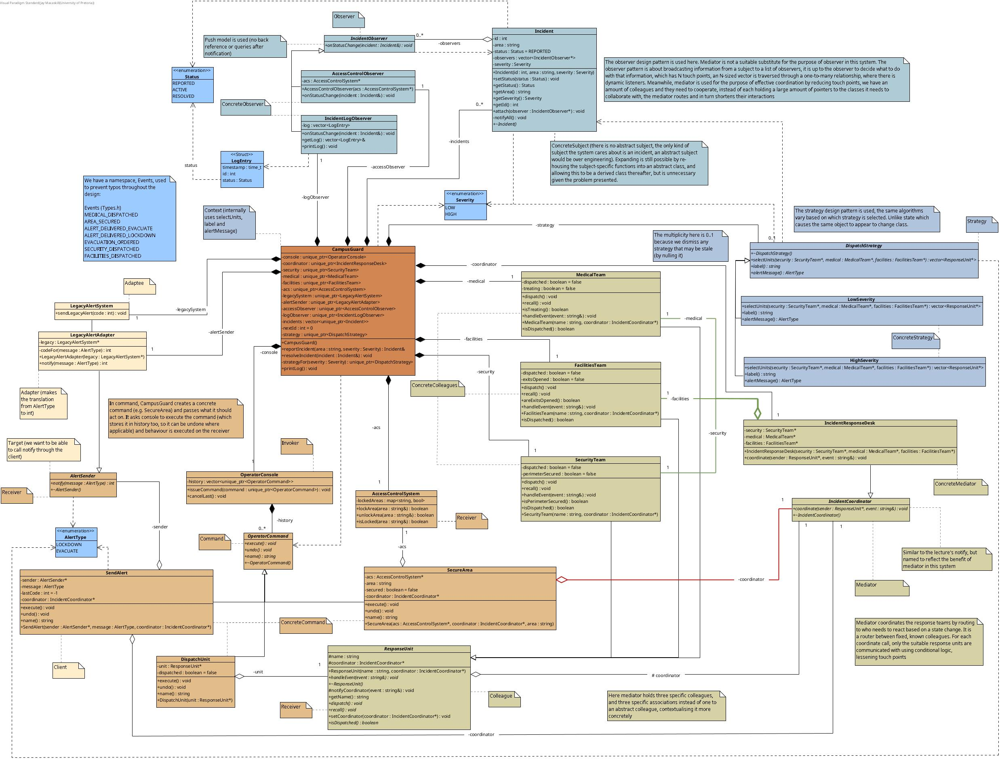
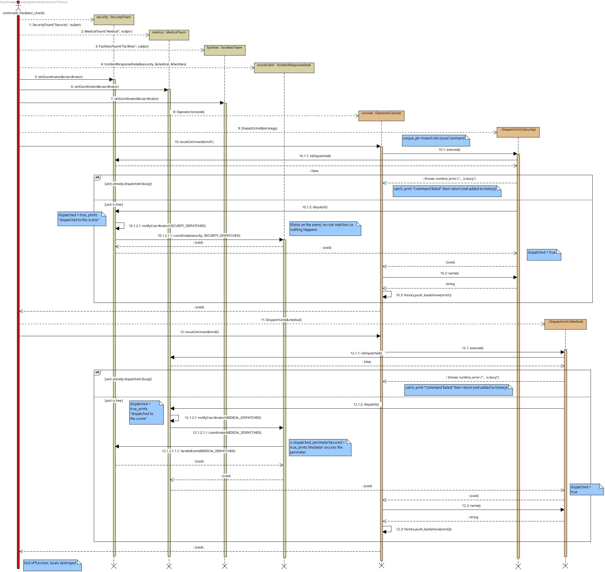
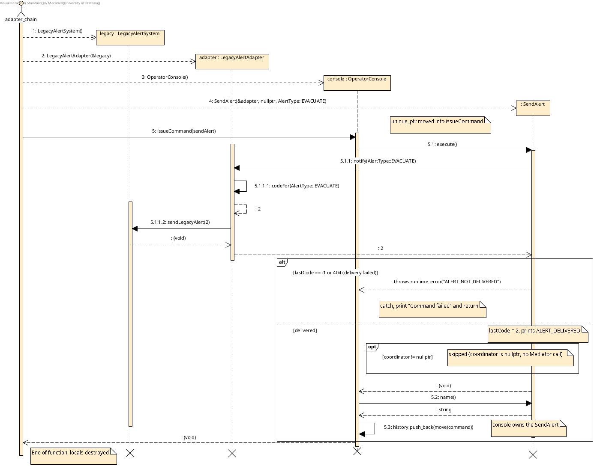
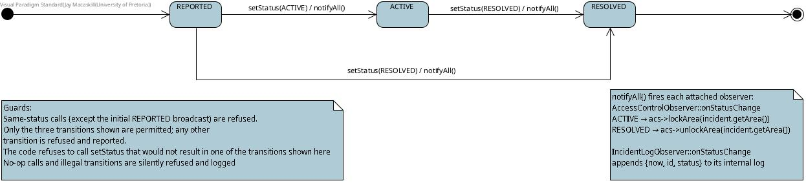

# 🏫 CampusGuard — Emergency Response Coordination

COS 214 Practical 5 — *CampusGuard: Emergency Response Coordination*

<p align="center">
  
</p>

---

## 👥 Team

| Name | Student Number |
|---|---|
| Emmanuel Boateng | 23586975 |
| Mohammadhossein Jafari | 25312040 |
| Jay Macaskill | 25198387 |

For the full PDF with required tasks, click <a href="practicals/practical_5/doc/COS_214_PA_5.pdf">here</a>

---

## 🏗️ System Concept

**CampusGuard** coordinates the response to incidents on a university campus. An operator reports an
incident (an area and a severity) and the system takes it from *reported* to *resolved*:

1. the severity decides **which response teams go** and **which alert is sent**,
2. each action is issued as an undoable **command**,
3. teams react to **each other** through a coordinator, never directly,
4. alerts go out through an **old integer-only alert panel**,
5. the incident's status changes are **broadcast** so doors lock and unlock and a history is kept.

Campus has **one main team of each kind** (Security, Medical, Facilities). If a team is already out on
an incident, a second dispatch is refused and reported (`❌ Command failed: ... is busy`), never silently ignored.

### One incident, end to end (HIGH severity at the Library)

```
guard.reportIncident("Library", HIGH)                       Facade
 ├─ HighSeverity picks Security + Medical + Facilities       Strategy
 ├─ DispatchUnit x3 issued through the OperatorConsole       Command
 │    └─ Medical dispatched → desk tells Security            Mediator
 │         └─ Security secures the perimeter
 ├─ SecureArea locks the Library                             Command
 │    └─ AREA_SECURED → desk tells Medical → treating        Mediator
 ├─ SendAlert(EVACUATE) → adapter → legacy panel code 2      Adapter
 │    └─ ALERT_DELIVERED_EVACUATE → Facilities opens exits   Mediator
 └─ status → ACTIVE: log entry + observer tries to lock      Observer
      (already locked by the command → refused and handled)  failure case
```

A LOW severity incident dispatches only Security and sends a **lockdown** instead. Lockdown has no
listener in the mediator, so nothing else reacts. That difference in behaviour comes entirely from
swapping the strategy object.

---

## 🧩 Design Patterns

Six GoF patterns collaborate in one application:

| Pattern | Participants | Problem it solves here |
|---|---|---|
| **Command** | `OperatorCommand` (Command), `DispatchUnit` / `SecureArea` / `SendAlert` (Concrete Commands), `OperatorConsole` (Invoker), the response units / `AccessControlSystem` / `AlertSender` (Receivers), `CampusGuard` (Client) | Operator actions become objects that can be executed, remembered and undone (dispatch → recall, secure → unlock; alerts refuse undo). A refused command is reported as failed and never recorded in the history. |
| **Mediator** | `IncidentCoordinator` (Mediator), `IncidentResponseDesk` (Concrete Mediator), `ResponseUnit` (Colleague), `SecurityTeam` / `MedicalTeam` / `FacilitiesTeam` (Concrete Colleagues) | The teams must react to each other, but none holds a pointer to another. Only the desk knows who reacts to what. |
| **Adapter** | `AlertSender` (Target), `LegacyAlertSystem` (Adaptee), `LegacyAlertAdapter` (Adapter) | The old panel only understands integer codes. The adapter translates `AlertType` → code (`LOCKDOWN` → 1, `EVACUATE` → 2). |
| **Facade** | `CampusGuard` | `reportIncident` / `resolveIncident` hide a multi-step workflow across the strategy, commands, mediator, adapter and observers. Every subsystem stays independently usable. |
| **Observer** *(chosen)* | `IncidentObserver` (Observer), `Incident` (Subject), `IncidentLogObserver`, `AccessControlObserver` (Concrete Observers) | An open-ended set of listeners needs to react to a status change. One keeps a log, the other actually locks/unlocks the area. |
| **Strategy** *(chosen)* | `DispatchStrategy` (Strategy), `HighSeverity` / `LowSeverity` (Concrete Strategies), `CampusGuard` (Context) | Severity decides which units are dispatched **and** which alert type is sent, without conditionals in the facade's workflow. |

**Why Observer and not Mediator for status changes?** The mediator coordinates a *fixed, known* set of
colleagues. Observer broadcasts to an *open-ended* list of listeners that the subject knows nothing about.

### Mediator event routing

| Event | Routed to | Reaction (only if that unit is dispatched) |
|---|---|---|
| `MEDICAL_DISPATCHED` | Security | secures the perimeter |
| `AREA_SECURED` | Medical | begins treating |
| `ALERT_DELIVERED_EVACUATE` | Facilities (translated to `EVACUATION_ORDERED`) | opens the emergency exits |
| anything else | nobody | ignored (not every action needs a reaction) |

### Ownership and destruction policy

- `CampusGuard` **owns** everything it builds, through `std::unique_ptr`.
- `OperatorConsole` owns the commands in its history (`vector<unique_ptr<OperatorCommand>>`).
- The mediator, observers, commands and adapter hold **non-owning raw pointers**. They never outlive `CampusGuard`.
- `Incident` never owns its observers (they outlive any single incident).
- Every polymorphic base class has a virtual destructor.

---

## 🖥️ Interactive Demo

```bash
./demo
```

The demo asks for your **name** and opens a control room menu:

| Option | What it shows |
|---|---|
| 1 🚨 Report an incident | The whole system through the **Facade**: pick an area and a severity, and every pattern fires. |
| 2 ✅ Resolve the incident | Doors reopen, teams stand down, and the **Observer** log is printed. |
| 3 🎮 Command | Dispatch and secure as commands, then **undo** them. |
| 4 🕸️ Mediator | Teams reacting to each other through the desk. |
| 5 🔌 Adapter | `AlertType` translated to the legacy panel's integer codes. |
| 6 👁️ Observer | Status changes driving a door lock and a log. |
| 7 🧭 Strategy | What `LowSeverity` and `HighSeverity` each select. |
| 8 💥 Failure cases | Six invalid operations, each reported and survived. |
| 9 🎬 Everything at once | All of the above, hands-off. |

Type **`demo`** as your name to skip the menu and run everything automatically.

---

## 🐳 Docker

<p align="center">
  
</p>

No local dependencies are required — the `Dockerfile` provides `g++`, `make`, `gdb` and `valgrind`.

**Build and launch the demonstration**
```bash
docker compose up --build
```
This builds the image from the Dockerfile and starts the container. The interactive demo begins automatically and runs statically without user input.

**Run the static tests**
```bash
docker compose run --rm campusguard ./campusguard
```

**Run the demo interactively**
```bash
docker compose run --rm campusguard ./demo
```

**Debug with GDB** (drop into a shell instead of running directly):
```bash
docker compose run --rm campusguard bash
gdb ./campusguard # static
gdb ./demo        # interactive
```

**Check for memory leaks with Valgrind**
```bash
docker compose run --rm campusguard make valgrind      # static scenarios
docker compose run --rm campusguard make valgrind-demo # interactive demo
```
---

## 🛠️ Building

This project targets **C++11** and is built with the provided `Makefile`.

```bash
make
```

This produces two executables:

```
campusguard   # static tests of every pattern and the full workflow
demo          # interactive, menu-driven demonstration
```

To clean build artefacts:

```bash
make clean
```

---

## ▶️ Running

```bash
./campusguard
```

Runs the static scenarios: mediator and command chains, the facade with both strategies, the adapter,
and the observers, printing pass/fail lines for each check.

```bash
./demo
```

Runs the interactive demo described above.

---

## 🧪 Debugging

```bash
make valgrind          # runs campusguard under Valgrind
make valgrind-demo     # runs demo under Valgrind
```

GDB can be attached the usual way, e.g. `gdb ./campusguard`.

Both executables were run under Valgrind with `--leak-check=full`: all heap blocks freed, 0 errors,
including the quick demo, a full menu walk, and the demo's input closing mid-menu.

---

## 📐 Diagrams

For a full PDF with required diagrams, click <a href="practicals/practical_5/doc/Diagrams.pdf">here</a>

<p align="center">
  
  <br/><sub><em>UML class diagram</em></sub>
</p>

<p align="center">
  
  <br/><sub><em>UML sequence diagram #1</em></sub>
</p>

<p align="center">
  
  <br/><sub><em>UML sequence diagram #2</em></sub>
</p>

<p align="center">
  
  <br/><sub><em>UML state diagram</em></sub>
</p>

---

## 🔀 GitHub Repository

<a href="https://github.com/MH-Multy/COS214_prac5">This</a> repository was used throughout development by all three team members.